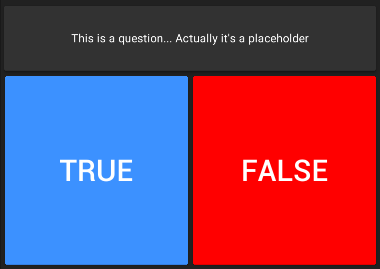

# Quiz Game

Quiz Game is an interactive Unity-based application that challenges players with a series of questions across various topics. Test your knowledge and see how many questions you can answer correctly!



## Features

- **Diverse Questions**: Engage with a wide range of topics to test your knowledge.
- **User-Friendly Interface**: Enjoy a clean and intuitive design for seamless gameplay.

## Installation

1. **Clone the Repository**:

   ```bash
   git clone https://github.com/vosidovmsaid2007/QuizGame.git
   ```

2. **Open in Unity**:

   - Launch Unity Hub.
   - Click on the "Add" button and select the cloned repository folder.
   - Open the project in Unity Editor.

3. **Play the Game**:

   - In the Unity Editor, press the "Play" button to start the game.

## Contributing

Contributions are welcome! If you have suggestions for new features, improvements, or bug fixes, please open an issue or submit a pull request.

## License

This project is licensed under the MIT License. See the [LICENSE](LICENSE) file for details.

## Acknowledgments

- Developed by Vosidov Muhammadsaid.
- Special thanks to the Unity community for their support and resources.

---

Feel free to share your feedback or ideas to improve the game. Happy gaming!
